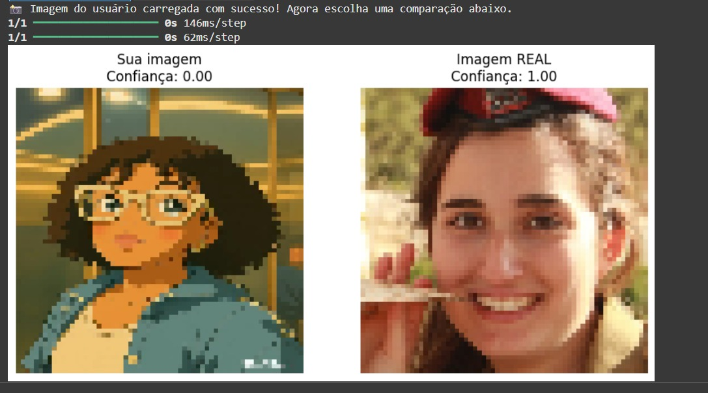
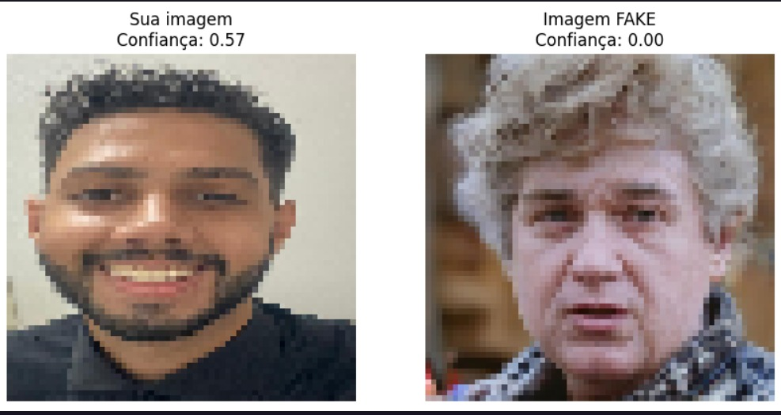
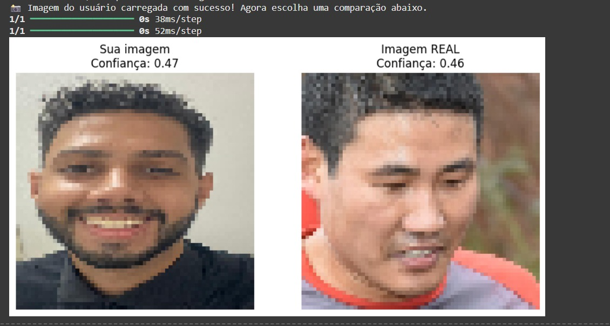

# Detecção de Imagens Falsas com GAN

Este projeto utiliza uma GAN (Rede Adversarial Generativa) para treinar um discriminador capaz de classificar imagens como reais ou falsas. Também inclui uma interface interativa via Jupyter Notebook, onde o usuário pode testar imagens do dataset, imagens geradas ou carregar sua própria imagem para avaliação.


## 👥 Autores
Este projeto foi desenvolvido como parte da disciplina de Processamento Digital de Imagens (2025.1).

1 - Carol Ribeiro

2 - Matheus Garcia

3 - Marcelo Nunes

4 - Vinicius Cavalcanti

5 - Zhihang Lin

---

## Requisitos

Antes de tudo, certifique-se de ter o Python 3.8 ou superior instalado.


### Instale as bibliotecas necessárias:

```bash
pip install tensorflow matplotlib ipywidgets pillow
```

### 🗂️ Base de Dados – RVF10k

Utilizamos o dataset [**RVF10k – Real vs Fake 10k**](https://www.kaggle.com/datasets/sachchitkunichetty/rvf10k), disponível no Kaggle.

Este conjunto contém 10.000 imagens classificadas como:

- **Reais:** imagens autênticas capturadas por câmeras
- **Falsas:** imagens geradas por inteligência artificial

Para este projeto, selecionamos **1.500 imagens reais** e **1.500 imagens falsas**, garantindo equilíbrio entre as classes.
As imagens foram redimensionadas para o formato **64x64 pixels RGB**, mantendo compatibilidade com a arquitetura da rede neural.

> 📦 O dataset original pode ser acessado no Kaggle:
> [https://www.kaggle.com/datasets/sachchitkunichetty/rvf10k](https://www.kaggle.com/datasets/sachchitkunichetty/rvf10k)

## Estrutura esperada do projeto

```
projeto_pdi/
│
├── dataset/
│   └── valid/
│       ├── real/    ← Imagens reais (1500 imagens)
│       │   ├── imagem1.jpg
│       │   └── ...
│       └── fake/   ← Imagens falsas (1500 imagens)
│           ├── imagem1.jpg
│           └── ...
│
├── projeto_gan.ipynb
└── README.md
```


## Etapas do Projeto

1. **Carregamento e Pré-processamento do Dataset**

    O conjunto de dados contém 3.000 imagens no total:

    - 1500 imagens reais

    - 1500 imagens falsas

    Todas redimensionadas para o formato 64x64 pixels com 3 canais (RGB). O dataset é carregado usando image_dataset_from_directory, já com rótulos binários atribuídos automaticamente.


2. **Definição do Discriminador**

    O discriminador é uma rede neural densa, sem camadas convolucionais, composta por:

    - Camadas Dense para capturar padrões visuais

    - Função de ativação LeakyReLU

    - Camadas Dropout para evitar overfitting

    Este modelo retorna uma saída binária: 1 (real) ou 0 (falsa).


3. **Definição do Gerador**

    O gerador transforma um vetor de ruído aleatório (100 dimensões) em uma imagem sintética:

    - Utiliza camadas Dense + Conv2DTranspose para expandir o ruído em uma imagem visual

    - Ativação final: tanh, com saída normalizada entre -1 e 1


4. **Criação da GAN**

    A GAN combina gerador e discriminador:

    - O gerador tenta enganar o discriminador com imagens falsas

    - O discriminador tenta aprender a distinguir real de fake

    - O sistema é treinado em ciclos, ajustando ambos os modelos simultaneamente

5. **Treinamento do Modelo**
    - Treinamento com épocas configuráveis (ex: 300)

    - O modelo alterna entre treinar o discriminador e atualizar o gerador

    - A cada 10 épocas, são exibidas imagens geradas pelo modelo para visualização da evolução

6. **Interface Interativa**
    Após o treinamento, widgets interativos permitem:

    - Testar imagens reais ou falsas do dataset

    - Gerar novas imagens com o gerador

    - Fazer upload de uma imagem personalizada para avaliação

    - Comparar visualmente a imagem do usuário com uma imagem real ou falsa do conjunto

## Testando o nosso modelo

**Nesta seção, mostraremos o projeto funcionando com fotos e vídeos.**

<div align="center"> 

**Foto 1** – *Imagem Falsa (esquerda) vs Real (direita)*

Nesta comparação, testamos uma imagem gerada por IA (ChatGPT) contra uma imagem autêntica do nosso DataSet. O modelo atribuiu uma confiança de **0.00**, mostrando sua capacidade de identificar manipulações.




**Foto 2** – *Imagem Real (esquerda) vs Falsa (direita)*

Aqui fizemos o caminho inverso: uma foto real é comparada com uma imagem falsa. Essa situação é ideal para verificar se o modelo **mantém coerência** mesmo quando a imagem verdadeira aparece primeiro. Aqui observamos uma confiança de 0.57 atribuída pelo modelo. Embora o treinamento ainda esteja em estágios iniciais, esse valor já indica que o modelo começa a identificar diferenças sutis entre imagens reais e falsas. Mesmo com poucas épocas, ele demonstra potencial para evoluir e tomar decisões cada vez mais precisas.




**Foto 3** – *Imagem Real (esquerda) vs Real (direita)*

Por fim, testamos duas imagens reais. O objetivo aqui é verificar se o modelo não apresenta viés de classificação, ou seja, **se não classifica erroneamente imagens reais como falsas**. Isso ajuda a confirmar que o modelo aprendeu a generalizar e não apenas memorizar. A confiança ainda estava baixa pela falta de treinamento do modelo, mas já vemos que ele consegue analisar as duas imagens. </div>

### Vídeos do Projeto
Os vídeos que mostram o funcionamento da interface interativa e dos testes com o modelo treinado estão disponíveis na pasta do projeto.

[🎥 Clique aqui para acessar os vídeos](./media/pdi-explicando-imagem-falsa.mp4)
